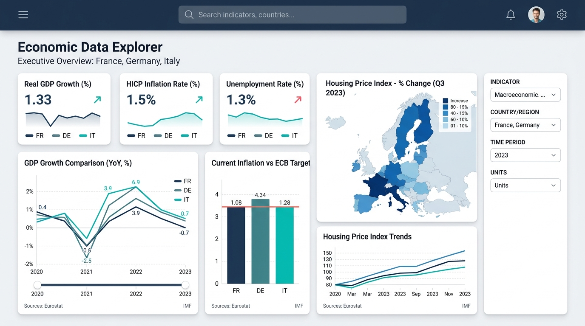

<div align="center">

# 📊 Economic Data Explorer


<p align="center">
  <strong>Plateforme unifiée d'intelligence macroéconomique et d'analyse statistique internationale</strong>
</p>

[](https://developer.mozilla.org/fr/docs/Web/Progressive_web_apps)
[](https://ec.europa.eu/eurostat)
[](https://www.imf.org/external/datamapper/)
[](#)
[](#)

</div>

---

## 📸 Aperçu de l'Application

<div align="center">
  
  <p><em>Interface exécutive d'exploration macroéconomique avec menu hamburger, thème clair/sombre, graphiques multi-pays et métadonnées SDMX 3.0.</em></p>
</div>

---

## 🌟 Nouvelles Fonctionnalités Majeures

### 1. 🍔 Menu Hamburger Catégorisé
Accessible sur tous les formats d'écran via le bouton menu dans le bandeau supérieur. Il organise logiquement les fonctionnalités en 5 grandes catégories :
* **📊 Exploration & Données** :
  * *Tableau de bord* : Indicateurs en direct (PIB, Inflation, Dette, Emploi, Immobilier).
  * *Explorateur dynamique* : Moteur de recherche avancé avec graphiques, cartes et tableaux.
  * *Datasets & Métadonnées* : Dictionnaire SDMX 3.0, dimensions et structures DSD.
* **⚖️ Analyse & Comparaison** :
  * *Comparateur multi-pays* : Benchmark simultané d'économies avec garde-fou d'unités incompatibles.
* **⭐ Espaces Personnels** :
  * *Analyses Favorites* : Requêtes mémorisées consultables hors ligne.
  * *Historique des requêtes* : Journal des recherches avec rechargement en 1 clic.
* **⚙️ Système & Préférences** :
  * *Paramètres système* : État des versions, vérifications et forçage de mise à jour.
  * *Bascule de thème* : Clair, Sombre ou Automatique (Système).
  * *Cache IndexedDB* : État et purge du cache local.
* **💡 Aide & Documentation** :
  * *Guide d'onboarding* : Parcours interactif de découverte.
  * *Centre d'aide contextuelle* : Lexique macroéconomique et FAQ.
  * *Architecture technique* : Modèle unifié et spécifications API.

---

### 2. ⚙️ Menu de Paramètres Système & Mises à Jour
La modale de paramètres système (`SystemSettingsModal`) fournit un contrôle technique complet :
* **📅 Date de sortie** : Date officielle de la version actuelle (`27 Septembre 2026`, version `v1.2.0`).
* **🕒 Date de la dernière vérification** : Horodatage précis au format localisé de la dernière interrogation des serveurs.
* **🔄 Bouton « Vérifier les mises à jour »** : Déclenche l'inspection du Service Worker et teste la connectivité de production.
* **⚡ Bouton « Forcer la mise à jour »** : Purge immédiate des caches du Service Worker, suppression des anciens assets et rechargement propre.
* **🗑️ Vider le cache IndexedDB** : Nettoyage sélectif des données statistiques locales.

---

### 3. 🔄 Système de Mises à Jour Automatiques en Arrière-Plan
* **Vérification périodique silencieuse** : Un cron automatique s'exécute en arrière-plan toutes les 10 minutes pour détecter la publication de nouveaux bundles.
* **Installation transparente** : Le Service Worker télécharge et pré-met en cache les nouveaux assets sans bloquer le travail de l'utilisateur.
* **Toast d'activation immédiate** : Un bandeau discret (`UpdateNotificationToast`) apparaît automatiquement pour proposer un rechargement sans perte de données.
* **Interrupteur configurable** : Possibilité de désactiver les mises à jour automatiques dans les paramètres système.

---

### 4. ☀️ Thème Clair, Onboarding, Aide Contextuelle & Infobulles
* **☀️ Thème Clair & 🌙 Thème Sombre** : Palette typographique soignée avec contrastes optimaux (ardoise, bleu cobalt, or boursier).
* **✨ Parcours d'Onboarding Interactif** : 4 étapes illustrées accueillant les nouveaux utilisateurs et réactivable depuis le menu Hamburger.
* **❓ Aide Contextuelle Adaptative** : La modale d'aide s'adapte automatiquement à l'écran actif (Dashboard, Explorer, Compare, etc.) et propose un lexique complet (PIB, IPCH, HPI, SDMX).
* **💬 Infobulles (Tooltips) Systématiques** : Explications instantanées sur les drapeaux, métriques, boutons de rafraîchissement et options de filtrage.

---

## 🏛️ Architecture Technique & Modèle Unifié

L'application découple strictement l'interface utilisateur des spécificités des fournisseurs grâce à un **Pipeline Unifié** :

```text
                    ECONOMIC DATA EXPLORER
                             │
                             ▼
                    React 19 / Vite / PWA
                             │
                             ▼
                       Query Engine
                             │
                             ▼
                    Unified Data Model
                             │
              ┌───────────────┴───────────────┐
              ▼                               ▼
       EurostatProvider                  IMFProvider
              │                               │
        ┌─────┴─────┐                   ┌─────┴─────┐
        ▼           ▼                   ▼           ▼
     SDMX 3.0   JSON-stat             SDMX 3.0   DataMapper
        │           │                   │           │
        └─────┬─────┘                   └─────┬─────┘
              ▼                               ▼
           EUROSTAT                           IMF
```

### Modules Clés
1. **Moteur de Requêtes (`src/services/QueryService.ts`)** : Coordonne les requêtes multi-sources, la gestion du cache et la persistance.
2. **Normalisation (`src/services/NormalizationService.ts`)** : Harmonisation des codes ISO-2 / ISO-3, des formats de dates (`2025-Q1`) et des unités.
3. **Cache Local (`src/services/CacheService.ts`)** : Base IndexedDB avec durées d'expiration différenciées (Métadonnées : 7j, Historique : 3j, Requêtes : 4h).
4. **Service de Mise à Jour (`src/services/UpdateService.ts`)** : Détection des versions, contrôle du Service Worker et gestion du cycle de vie PWA.

---

## 🚀 Installation & Développement

```bash
# 1. Installation des dépendances
npm install

# 2. Lancement du serveur de développement (Port 3000)
npm run dev

# 3. Validation TypeScript & Linting
npm run lint

# 4. Compilation de production
npm run build
```

---

## 📄 Licence
Sous licence **Apache-2.0**. Développé avec **React 19**, **Tailwind CSS**, **Vite** et les APIs officielles d'**Eurostat** et du **FMI**.
